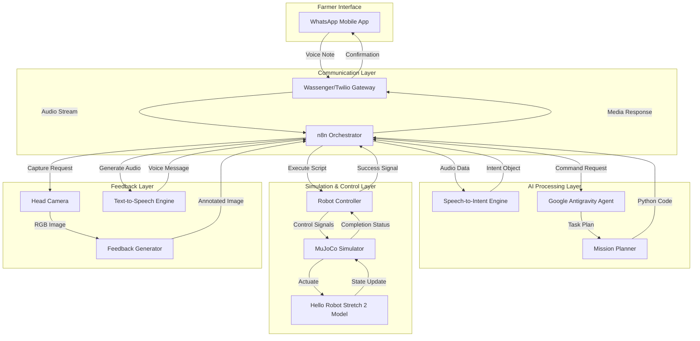
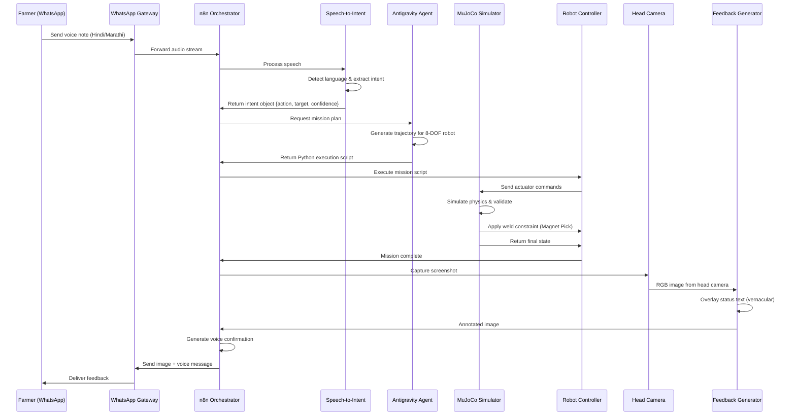

# Design Document: Kisan-Drishti (Farmer's Vision)

## Overview

Kisan-Drishti is a vernacular-first robotics control system that bridges the gap between rural Indian farmers and autonomous agricultural robots. The system architecture follows a microservices pattern with n8n as the central orchestration layer, connecting WhatsApp-based voice interfaces to Google Antigravity's agentic planning capabilities and MuJoCo physics simulation.

The design prioritizes:
- **Accessibility**: Voice-first interaction in regional Indian languages
- **Autonomy**: AI-driven mission planning requiring minimal user input
- **Reliability**: Physics-validated execution with visual confirmation
- **Familiarity**: WhatsApp as the sole user interface

## Architecture

### High-Level System Architecture



### Data Flow Sequence



## Components and Interfaces

### 1. WhatsApp Gateway (Wassenger/Twilio)

**Responsibilities:**
- Authenticate incoming WhatsApp messages
- Convert voice notes to audio streams
- Deliver multimedia responses (images, voice messages)
- Maintain session state per farmer phone number

**Interface:**
```python
class WhatsAppGateway:
    def receive_message(phone_number: str, message_type: str, content: bytes) -> Message
    def send_text(phone_number: str, text: str, language: str) -> bool
    def send_media(phone_number: str, image: bytes, caption: str) -> bool
    def send_voice(phone_number: str, audio: bytes) -> bool
    def get_session(phone_number: str) -> Session
```

### 2. n8n Orchestrator

**Responsibilities:**
- Route requests through the processing pipeline
- Handle retries and error recovery
- Log all transactions for debugging
- Enforce latency SLAs (15 seconds end-to-end)
- Coordinate asynchronous component interactions

**Interface:**
```python
class N8NOrchestrator:
    def process_voice_command(session_id: str, audio: bytes) -> Response
    def log_transaction(transaction_id: str, component: str, status: str, latency_ms: int) -> None
    def handle_error(error: Exception, context: dict) -> ErrorResponse
    def get_metrics() -> Metrics
```

**Workflow Configuration:**
- Webhook trigger for WhatsApp messages
- HTTP nodes for external API calls
- Function nodes for data transformation
- Error handling with retry logic

### 3. Speech-to-Intent Engine

**Responsibilities:**
- Detect language from audio (Hindi, Marathi, Tamil, Telugu, Bengali, Gujarati)
- Transcribe speech to text
- Extract structured intent (action, target, modifiers)
- Calculate confidence scores

**Interface:**
```python
class SpeechToIntentEngine:
    def detect_language(audio: bytes) -> LanguageCode
    def transcribe(audio: bytes, language: LanguageCode) -> str
    def extract_intent(transcript: str, language: LanguageCode) -> Intent
    
class Intent:
    action: str  # "pick", "move", "inspect"
    target: dict  # {"object": "strawberry", "location": "left_side"}
    modifiers: list[str]  # ["ripe", "large"]
    confidence: float  # 0.0 to 1.0
    language: LanguageCode
```

**Implementation Notes:**
- Use Google Speech-to-Text API with Indian language models
- Intent extraction via fine-tuned LLM (Gemini) with agricultural domain knowledge
- Fallback to English if confidence < 0.7

### 4. Google Antigravity Agent

**Responsibilities:**
- Generate autonomous mission plans from high-level intents
- Calculate optimal 8-DOF trajectories
- Produce executable Python code for MuJoCo
- Handle constraint violations and replanning

**Interface:**
```python
class AntigravityAgent:
    def plan_mission(intent: Intent, robot_state: RobotState, scene: Scene) -> MissionPlan
    def generate_code(mission_plan: MissionPlan) -> str  # Python code
    def validate_plan(mission_plan: MissionPlan) -> ValidationResult
    
class MissionPlan:
    phases: list[Phase]  # [approach, grasp, retract]
    actuator_sequence: list[ActuatorCommand]
    estimated_duration: float
    constraints: list[Constraint]
```

**Actuator Command Structure:**
```python
class ActuatorCommand:
    actuator_id: int  # 0-7 (base_forward, base_turn, lift, arm, wrist, grip, head_pan, head_tilt)
    target_value: float
    duration: float
    interpolation: str  # "linear", "cubic"
```

### 5. MuJoCo Simulator & Robot Controller

**Responsibilities:**
- Load Hello Robot Stretch 2 model from Menagerie
- Execute Python scripts in simulation environment
- Apply physics constraints (gravity, collisions, joint limits)
- Implement "Magnet Pick" using weld constraints
- Capture RGB images from head camera

**Interface:**
```python
class RobotController:
    def load_model(model_path: str) -> Model
    def execute_script(code: str, timeout: float) -> ExecutionResult
    def get_state() -> RobotState
    def apply_weld_constraint(body1: str, body2: str) -> bool
    def capture_camera_image(camera_name: str) -> np.ndarray
    
class RobotState:
    actuator_positions: list[float]  # 8 DOF values
    gripper_status: str  # "open", "closed", "holding"
    base_position: tuple[float, float, float]  # x, y, z
    held_objects: list[str]
```

**MuJoCo Integration:**
```python
import mujoco
import mujoco.viewer

def simulate_mission(model: mujoco.MjModel, data: mujoco.MjData, commands: list[ActuatorCommand]):
    for cmd in commands:
        data.ctrl[cmd.actuator_id] = cmd.target_value
        mujoco.mj_step(model, data)
    return data
```

### 6. Feedback Generator

**Responsibilities:**
- Capture screenshots from robot's head camera
- Overlay mission status text in vernacular language
- Generate voice confirmation messages
- Compress images for WhatsApp delivery

**Interface:**
```python
class FeedbackGenerator:
    def capture_and_annotate(camera_image: np.ndarray, status: str, language: LanguageCode) -> bytes
    def generate_voice_message(text: str, language: LanguageCode) -> bytes
    def compress_image(image: bytes, max_size_kb: int) -> bytes
```

**Annotation Strategy:**
- Green overlay for success, red for failure
- Text positioned at top of image
- Include timestamp and mission ID
- Use Unicode fonts for Devanagari and other scripts

## Data Models

### Intent Object
```python
@dataclass
class Intent:
    intent_id: str
    timestamp: datetime
    farmer_id: str
    language: LanguageCode
    action: ActionType  # PICK, MOVE, INSPECT, CANCEL
    target: Target
    confidence: float
    raw_transcript: str

@dataclass
class Target:
    object_type: str  # "strawberry", "basket"
    location: Location
    attributes: dict[str, str]  # {"ripeness": "ripe", "size": "large"}

@dataclass
class Location:
    reference_frame: str  # "robot", "world", "relative"
    coordinates: tuple[float, float, float] | None
    description: str  # "left side", "near basket"
```

### Mission Plan
```python
@dataclass
class MissionPlan:
    plan_id: str
    intent_id: str
    phases: list[Phase]
    total_duration: float
    success_criteria: list[str]
    failure_conditions: list[str]

@dataclass
class Phase:
    phase_name: str  # "approach", "grasp", "retract"
    actuator_commands: list[ActuatorCommand]
    duration: float
    preconditions: list[str]
    postconditions: list[str]
```

### Session Context
```python
@dataclass
class Session:
    session_id: str
    farmer_id: str
    phone_number: str
    language: LanguageCode
    created_at: datetime
    last_activity: datetime
    conversation_history: list[Intent]
    robot_state: RobotState
    picked_objects: list[str]
```

### Response Object
```python
@dataclass
class Response:
    response_id: str
    intent_id: str
    status: ResponseStatus  # SUCCESS, FAILURE, CLARIFICATION_NEEDED
    message: str  # In farmer's language
    image: bytes | None
    voice_message: bytes | None
    metadata: dict
```

## Correctness Properties


*A property is a characteristic or behavior that should hold true across all valid executions of a system - essentially, a formal statement about what the system should do. Properties serve as the bridge between human-readable specifications and machine-verifiable correctness guarantees.*

### Property 1: Voice Interface Latency

*For any* voice note received via WhatsApp, the time from receipt to forwarding to the Speech_To_Intent_Engine should be less than 2 seconds.

**Validates: Requirements 1.1**

### Property 2: Intent Extraction Completeness

*For any* voice note containing a picking command in any supported language, the extracted intent object should contain action type, target location, and confidence score.

**Validates: Requirements 1.3, 1.5**

### Property 3: Clarification on Invalid Input

*For any* voice note that is unclear or in an unsupported language, the system should send a clarification request in the detected language (or default language if detection fails).

**Validates: Requirements 1.4**

### Property 4: Mission Planning Latency

*For any* valid structured command object, the Antigravity Agent should generate a complete trajectory plan within 5 seconds.

**Validates: Requirements 2.1**

### Property 5: Pick Operation Phase Completeness

*For any* pick operation command, the generated mission plan should include all three phases: approach, grasp, and retract.

**Validates: Requirements 2.3**

### Property 6: Unreachable Target Notification

*For any* target location that is unreachable (outside workspace or obstructed), the system should notify the farmer with an explanation and suggest alternatives.

**Validates: Requirements 2.4**

### Property 7: Python Code Generation Validity

*For any* complete trajectory plan, the generated Python code should be syntactically valid and executable in the MuJoCo environment.

**Validates: Requirements 2.5**

### Property 8: Actuator Mapping Correctness

*For any* robot control command, the Robot Controller should map it to the correct actuator index according to the specification: 0=Forward, 1=Turn, 2=Lift, 3=Arm Extend, 4=Wrist Yaw, 5=Grip, 6=Head Pan, 7=Head Tilt.

**Validates: Requirements 3.2, 9.1, 9.2, 9.3, 9.4, 9.5, 9.6**

### Property 9: Weld Constraint Application

*For any* successful grasp operation where the gripper reaches a target object, the system should apply a weld constraint to attach the object to the gripper.

**Validates: Requirements 3.3**

### Property 10: Collision Detection and Reporting

*For any* trajectory that results in a collision, the MuJoCo Simulator should detect and report the collision with details about the colliding bodies.

**Validates: Requirements 3.4**

### Property 11: Robot State Return Completeness

*For any* completed picking operation, the returned robot state should include actuator positions, gripper status, base position, and list of held objects.

**Validates: Requirements 3.5**

### Property 12: Feedback Image Capture

*For any* completed picking operation, the system should capture an RGB screenshot from the robot's head camera that includes the gripper and picked object in the frame.

**Validates: Requirements 4.1, 4.2**

### Property 13: Feedback Language Consistency

*For any* feedback image, the overlaid status text should be in the farmer's preferred language as detected or configured in their session.

**Validates: Requirements 4.3**

### Property 14: Feedback Delivery Latency

*For any* ready feedback image, the time from image generation to WhatsApp delivery should be less than 3 seconds.

**Validates: Requirements 4.4**

### Property 15: Feedback Completeness

*For any* task completion, the feedback should include both an annotated image and a voice message in the farmer's language.

**Validates: Requirements 4.5**

### Property 16: User Authentication

*For any* incoming WhatsApp message, the system should authenticate the sender and validate their permissions before processing.

**Validates: Requirements 5.1**

### Property 17: Connection Retry with Exponential Backoff

*For any* WhatsApp Gateway connection failure, the system should retry up to 3 times with exponential backoff (e.g., 1s, 2s, 4s).

**Validates: Requirements 5.4**

### Property 18: Session Context Maintenance

*For any* active session, the system should maintain conversation history, robot state, and picked objects across multiple commands.

**Validates: Requirements 5.5, 10.2**

### Property 19: Pipeline Orchestration Completeness

*For any* voice note, the n8n Orchestrator should route it through all pipeline stages in order: Voice_Interface → Speech_To_Intent_Engine → Antigravity_Agent → Robot_Controller → Feedback_Generator.

**Validates: Requirements 6.1**

### Property 20: Comprehensive Logging

*For any* component interaction, the n8n Orchestrator should log the API call, response, timestamp, and latency.

**Validates: Requirements 6.2**

### Property 21: Error Handling with User Notification

*For any* component failure, the system should capture the error, notify the administrator, and send a user-friendly message to the farmer in their language.

**Validates: Requirements 6.3, 8.1, 8.2, 8.3, 8.5**

### Property 22: End-to-End Latency Enforcement

*For any* request, the total time from voice note receipt to feedback delivery should not exceed 15 seconds.

**Validates: Requirements 6.4**

### Property 23: Metrics Exposure

*For any* system with monitoring enabled, the n8n Orchestrator should expose metrics including request count, success rate, and average latency.

**Validates: Requirements 6.5**

### Property 24: Language Detection and Persistence

*For any* farmer's first interaction, the system should detect their language from the voice note and persist it for all future interactions in that session.

**Validates: Requirements 7.1, 7.2, 7.3**

### Property 25: Low Confidence Language Confirmation

*For any* language detection with confidence below 70%, the system should ask the farmer to confirm their language preference.

**Validates: Requirements 7.5**

### Property 26: Timeout Status Updates

*For any* component that times out, the system should send a status update to the farmer indicating processing is ongoing.

**Validates: Requirements 8.4**

### Property 27: Joint Limit Enforcement

*For any* actuator command, the Robot Controller should enforce joint limits and velocity constraints as defined in the MuJoCo model, clamping values that would violate constraints.

**Validates: Requirements 9.7**

### Property 28: Unique Session Creation

*For any* new conversation, the system should create a session with a unique identifier that doesn't collide with existing sessions.

**Validates: Requirements 10.1**

### Property 29: Context-Based Intent Inference

*For any* follow-up command that references previous context (e.g., "pick another one"), the system should correctly infer the action type and target from conversation history.

**Validates: Requirements 10.3, 10.5**

### Property 30: Session Timeout and Cleanup

*For any* session that has been inactive for 10 minutes, the system should close the session and clear its context.

**Validates: Requirements 10.4**

## Error Handling

### Error Categories

**1. Input Errors**
- Unsupported language or unclear speech
- Invalid command structure
- Missing required parameters

**Strategy:** Send clarification requests in farmer's language with examples of valid commands.

**2. Planning Errors**
- Unreachable target location
- Constraint violations
- Impossible grasp configurations

**Strategy:** Explain the constraint violation in simple terms and suggest alternative approaches (e.g., "The strawberry is too far. Should I move closer first?").

**3. Execution Errors**
- Collision during trajectory execution
- Gripper failure to grasp
- Physics simulation instability

**Strategy:** Abort operation immediately, return robot to safe state, send visual explanation showing the issue.

**4. Communication Errors**
- WhatsApp Gateway timeout
- Network connectivity loss
- Message delivery failure

**Strategy:** Retry with exponential backoff (3 attempts), queue messages for later delivery, notify farmer of delays.

**5. System Errors**
- Component crash or timeout
- Resource exhaustion
- Configuration errors

**Strategy:** Log detailed diagnostics, alert administrator, send generic error message to farmer, attempt graceful degradation.

### Error Response Format

```python
@dataclass
class ErrorResponse:
    error_id: str
    error_type: ErrorType
    user_message: str  # Localized, simple explanation
    admin_message: str  # Technical details
    suggested_actions: list[str]
    retry_possible: bool
    timestamp: datetime
```

### Graceful Degradation

- If Antigravity Agent is unavailable, fall back to rule-based planning for simple pick operations
- If MuJoCo simulation fails, log the command for manual review but don't block the pipeline
- If text-to-speech fails, send text-only responses
- If image annotation fails, send raw camera image

## Testing Strategy

### Dual Testing Approach

The system will be validated using both unit tests and property-based tests:

**Unit Tests** focus on:
- Specific examples of voice commands in each supported language
- Edge cases like empty audio, corrupted files, extremely long commands
- Integration points between n8n and external APIs
- Error conditions like network failures, invalid credentials

**Property-Based Tests** focus on:
- Universal properties that hold across all inputs (as defined in Correctness Properties section)
- Comprehensive input coverage through randomization
- Invariants that must be maintained (e.g., session uniqueness, actuator mapping correctness)

### Property-Based Testing Configuration

**Framework:** Use `hypothesis` for Python components

**Configuration:**
- Minimum 100 iterations per property test
- Each test tagged with: `# Feature: kisan-drishti, Property N: [property text]`
- Custom generators for domain objects (Intent, MissionPlan, RobotState)

**Example Property Test:**
```python
from hypothesis import given, strategies as st
import pytest

# Feature: kisan-drishti, Property 8: Actuator Mapping Correctness
@given(
    command_type=st.sampled_from(['forward', 'turn', 'lift', 'extend', 'yaw', 'grip', 'pan', 'tilt']),
    value=st.floats(min_value=-1.0, max_value=1.0)
)
def test_actuator_mapping_correctness(command_type, value):
    controller = RobotController()
    actuator_id = controller.map_command_to_actuator(command_type, value)
    
    expected_mapping = {
        'forward': 0, 'turn': 1, 'lift': 2, 'extend': 3,
        'yaw': 4, 'grip': 5, 'pan': 6, 'tilt': 7
    }
    
    assert actuator_id == expected_mapping[command_type]
```

### Integration Testing

**End-to-End Flow Tests:**
1. Send voice note → Verify feedback received within 15 seconds
2. Multi-turn conversation → Verify context maintained
3. Error injection → Verify graceful handling and user notification

**Component Integration Tests:**
- n8n ↔ WhatsApp Gateway
- n8n ↔ Antigravity Agent
- Robot Controller ↔ MuJoCo Simulator
- Feedback Generator ↔ WhatsApp Gateway

### Simulation Testing

**MuJoCo Test Scenarios:**
- Pick strawberries at various locations (near, far, high, low)
- Handle obstacles and collisions
- Test all 8 DOF actuators independently and in combination
- Validate weld constraint behavior
- Test camera positioning and image capture

**Performance Testing:**
- Measure latency at each pipeline stage
- Test under load (multiple concurrent farmers)
- Validate 15-second end-to-end SLA
- Test retry and backoff behavior

### Manual Testing

**Language Validation:**
- Native speakers test voice commands in each supported language
- Verify cultural appropriateness of translations
- Test dialect variations within languages

**User Experience:**
- Farmers test with real WhatsApp accounts
- Validate feedback clarity and usefulness
- Test error message comprehension

### Test Data

**Voice Note Corpus:**
- Collect sample voice notes in all supported languages
- Include variations: accents, background noise, speaking speed
- Cover all command types: pick, move, inspect, cancel

**Simulation Scenes:**
- Strawberry field with varying densities
- Obstacles (leaves, branches, other strawberries)
- Different lighting conditions
- Edge cases (empty field, unreachable locations)
